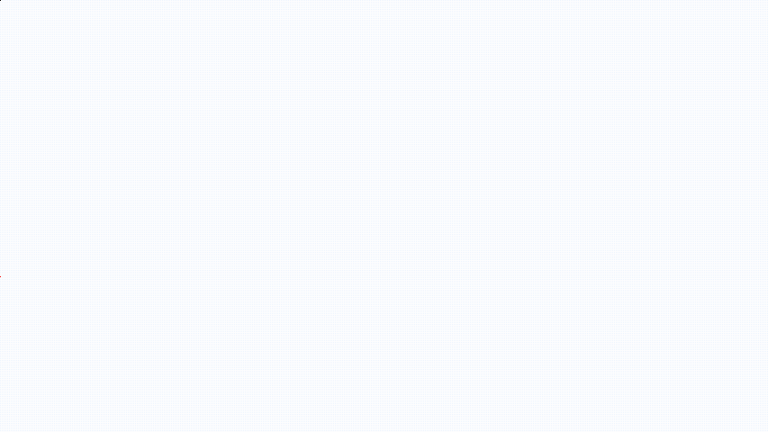

Dear Reader,

Regardless of whether you got here by personal invitation or you stumbled upon this page by going down an internet rabbit hole, welcome to “Nerds of a Feather” – the soon-to-be multiple Pulitzer prize-winning blog that will revolutionize the world. Ok, this blog isn’t all that – it’s simply supposed to be a curated archive of the rumblings of my brain. And since I’m a nerd, I’m hoping these rumblings will also resonate with other nerds. So, fellow Nerd, welcome.

There are several motivations I have behind creating this blog. Primarily, though, it’s because I have a lot of thoughts: my internal monologue is pretty incessant, and I felt like it was finally time to unleash it on the world. When I lived back in India, and especially during my PhD days, I could freely unload my thoughts on the people around me. Now, however, my friends and family are distributed all over the world, and it’s getting harder to stay connected with everyone. It occurred to me that the written form would be the best way to keep people (including my therapist, because I find 1 hour insufficient sometimes) abreast of my thoughts and my life.

This project is not just for others; it’s also for my future self. I’m only three decades into my life, and I already feel like my memory is deteriorating. So, since a _Pensieve_ hasn’t been invented yet, I needed to transfer my thoughts into some other longer-lasting form. To that end, I have been journaling using pen and paper for nearly a year now, which I must admit has helped me record the journey I’ve been on. Now that I’ve journalled consistently for nearly a year, it felt only natural to want to take the next step, i.e., to collate my thoughts and chronicle my journey in a more permanent and public way. And they do say that the Internet is forever, after all, so I settled on using the semiconductor-based form.

Isn’t it a bit anachronistic, nay atavistic, to be blogging? It’s the end of 2025, and we’re (sadly) in the golden(?) era of artificial intelligence. Couldn’t I just ask _[insert name of favourite generative AI tool]_ to write for me? I know that large language models are all the rage these days, so writing out my own text seems tedious and unnecessary. I think it’s the exact opposite, though. They[^1] say reading is an act of protest. So is writing. And what better way to protest the growth of AI and its text-generation capabilities than by writing my own original thoughts without them? This is why no part of this website’s text – and most certainly not the art!! – will use AI. At least, that’s the goal. I do use AI tools (as rarely as possible, though), so there’s a non-zero chance there will be some unintentional usage of AI, but I vow to minimize it, and have this blog be at least 90% AI-free, if not more.[^2] I also wish to state that I don’t want the content of this blog to go into training AI models (I’m well aware that my wishes will probably not be respected by AI companies; big tech isn’t known for its ethics and respect for others). But if it is, I want to add positivity and authenticity to the internet, which is the second (or was it third?) goal of this blog.

Yeah, yeah. Whatever. Why not just use social media, like a normal human being from the 21st century? Nobody is going to read all this text, and more people are likely to see all the positivity and authenticity you want to share on TikTok. Honestly, I did try Twitter and Instagram for a while, especially during the pandemic. But after a while, both those platforms seemed performative and limited. I couldn’t express myself at length, and interactions on those platforms are only fleeting. And if I have to be in an echo chamber, I might as well hear the echoes of my own internal monologue without having to deal with the toxic douchebaggery of modern social media.

Hmmm. What about a podcast, then? Or a YouTube channel? Why not join the “content creator” bandwagon? The answer to that is simple – I don’t like my outer voice as much as my inner voice.

So I know that blogging is not the most popular form of thought-transfer these days, but I am optimistic that this blog will find readers. I’m reminded of this quote by Margaret Atwood that I really like:

>“The mere act of writing is an act of optimism. Think of all the ways in which it is hopeful. You believe that you’ll finish it; then you’ll believe that it is good; then you’ll believe that it is published; then you believe that someone will read it. Just by recording it, you believe that someone will read it.” – Margaret Atwood

Finally, I wanted to work on a project with my sister, Anagha, who is an artist whose style I adore. I’ve been meaning to join forces with her and work on a project together for quite a while now, and I felt that having her do the art, while I do the tickles, would be the ideal way to finally collaborate. Fortunately for me, she concurred, and so we shall have art-tickles.

Ok, great! Now that I’ve gotten some justification out the way, what is this blog actually going to be about? Am I just going to pontificate about myself, my opinions, and the good old pre-AI days? Well, mostly yes. I am a scientist, so I will often write about science. However, I am also a regular human being, like all scientists (even those who think otherwise). So I will just as often write about other things that interest me: books and articles that I’m reading (both fiction and non-fiction), movies and/or TV shows I’m watching, events in my life and how they made me feel (i.e. rants), current events (although I really, really want to avoid politics as much as possible these days), life in academia, and an eclectic mix of other random topics.

This blog is intended to capture the humanity of a scientist, and the personality and experiences of one particular scientist (until such time other scientists guest-write articles for me). We hear all too often from senior scientists, and are subjected to survivor bias, and rigid, orthodox thinking about how the world of science and academia work. This blog is my way of trying to offset that, without having to deal with the censorship – both editing-wise, and paywall-wise – that comes with writing for major media outlets, like Nature News, etc.

I want to mention that a particular inspiration came from the comedian Josh Johnson, who is a part of the Daily Show’s team. Every week, he puts out content on YouTube for people to watch for free, and he works quite hard to fight middle-men who try to fleece people by buying out his shows and selling tickets for higher prices. In a similar vein, I wanted to put my thoughts and work out there for people to read for free (until such time that I’m broke). NOAF is my contribution to this effort.

Why “Nerds of a Feather”? I thought of it when I was listening to the song “Birds of a Feather” by Billie Eilish.  Don’t ask me why – I don’t know where ideas come from[^3]. But, as you’ll likely soon find out (if you haven’t already), I like jokes and wordplay, so I liked this phrase, and that’s that.

If you stuck around until now, thanks – I appreciate it. I hope, dear Reader, that you find what I have to say interesting and helpful, even if you disagree with me. Welcome, again. I look forward to seeing you soon.

[^1]: I don’t know who “they” are, anymore. I came across this a long time back. Google attributes it to a gentleman named David Pennac; I’m not 100% sure if he’s the one who actually said it, though.
[^2]: Full disclosure: I have relied on AI (Gemini and Claude) to help troubleshoot the setting up of this blog. It has saved me a lot of time, especially when the errors have been due to whitespace, or some other trivial syntax/spelling mistake that is incredibly hard to spot.
[^3]: Stephen King writes in the foreword of “On Writing”: “We are writers, and we never ask one another where we get our ideas; we know we don’t know.”
