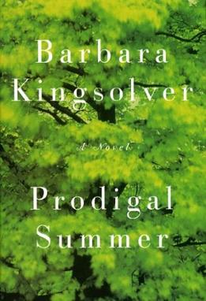
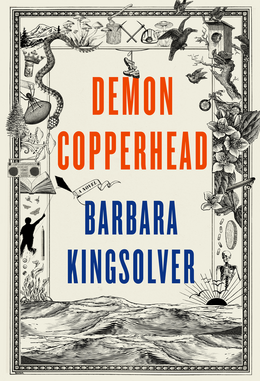
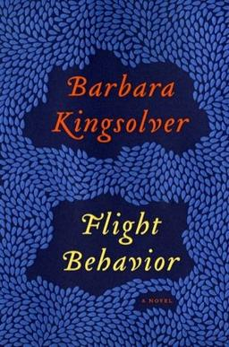

> **Spoiler Warning**: there are a few plot spoilers coming up. I try not to give away too much, though, and I believe that none of them will take away the joy of reading the books, in any case.

I’m a millennial, so it’s almost a given that JK Rowling was my favourite author while growing up. But though she may have been my first favourite (or maybe it was Enid Blyton?), she certainly wasn’t the last. I soon replaced her with Agatha Christie, PG Wodehouse, and Robert Jordan, and, once I entered my teens and started understanding the classics, I took a liking to Jane Austen, Charlotte Bronte, and Charles Dickens. I’m sure colonialism contributed to my preferences, but in general I enjoyed British more than American literature. The few famous American classics that I read – _The Catcher in the Rye_ and _The Great Gatsby_, mainly – didn’t appeal to me one bit, as I couldn’t relate to the characters and lacked a lot of the cultural context needed to appreciate these works. Also, American prose tended to be too simple, whereas British prose was more complex and poetic. So, until my late teens, the books I read were English, while the TV shows I watched were American. [^1]

[^1]: Not exclusively, of course. I’ve watched a fair share of Hindi soap operas, Malayalam movies, and anime, and have also read a decent amount of global literature.

My teens were a while ago, though, so I have outgrown and moved on from the likes of JK Rowling (thankfully), and I can’t wait to tell you about my current favourite author – Barbara Kingsolver.

I hadn’t even heard of this name until last year. Well, that’s not strictly true – I was recently re-reading Stephen King’s _On Writing_, in which he mentions that he belongs to an amateur music group made up of writers, called the “Rock Bottom Remainders”, and that Barbara Kingsolver is part of that group. So I _had_ come across the name before – I just hadn’t taken note of it. I wonder how many such names I have overlooked over the years. Anyway, although King and Kingsolver share social circles and a part of their surname, the similarities end there.

#### Prodigal Summer
The first Barbara Kingsolver book that I read was _Prodigal Summer_. I wanted to read _Demon Copperhead_, which had rave reviews and for which she recently won a Pulitzer prize, but the wait for my library hold was long, so I decided to test the waters with another, more readily available book first. Published in 2000, _Prodigal Summer_ follows three characters in rural Appalachia whose lives are all connected – they just don’t know it yet.

One character is a young entomologist named Lusa, who recently married a farmer and moved back with him to his farm. As a city person, she struggles with small-town life (I can relate!), finding it next to impossible to integrate with her in-laws. The sudden death of her husband leaves her even more alone, and she faces tough choices as she inherits his farm and his house. Lusa’s journey, then, is about deciding whether to abandon the legacy and memory of her husband and head back to the city, or find common ground with her in-laws and their way of life, the latter of which would involve confronting stereotypes and reconciling the differences between city and country folk.

The second character is Garrett, a grumpy old widower who is frustrated with this new generation and is clinging onto the glory of the past. He doesn’t believe in evolution, nor the new organic farming practices that his neighbour follows, and they often bicker about these subjects (she tends to win these arguments). He is passionate about reviving chestnuts from near-extinction, though, and has dedicated his life to cross-breeding their strains, unaware that in doing so he’s practising the very principles he seems to be dead set against.

The final character is Deanna, a wildlife biologist with a PhD, who left behind her life in the village after a toxic marriage to live alone in a cabin in the mountains and serve as a forest ranger. She enjoys her life as a recluse in the woods, far from people and the pressures imposed on women by society – marriage, children, and domestic life. Then she meets and falls in love with an attractive man, with whom she has a passionate affair, even though she knows that their goals are at odds since she is a ranger and he a hunter of the very animals she is trying to protect – coyotes. In fact, her doctoral thesis was about how hunting coyotes (especially mothers) was counterproductive to their population control, which hunters do not seem to understand. So she educates this ignorant, but intelligent (and did I mention attractive) hunter about the biology of female coyotes and female humans (well, one woman in particular), slowly finding her way back to civilization in the process.

There is much to love about this book, and I thought it was near perfection: the prose was exquisite, the characters relatable (yes, even the conservative creationist), and this was perhaps the first work of fiction I read that educated me about concepts in biology I didn’t know about – mainly the social structure of coyotes and why hunting them is counterproductive to their population control. I might re-read it (or listen to it) just to polish my knowledge of biology.

> **“Kingsolver's extensive education in biology is on display in this book, laden with ecological concepts and biological facts.”** – Prodigal Summer Wikipedia page

It was also probably my first time reading a book that featured realistic characters with PhDs who talk about their science (and their doctoral theses), sharing their research with other characters without condescension. It was a book in which scientists led regular human existences and faced regular human problems. And though a lot of the characters are solitary and/or mostly have interactions with the opposite sex, this book also passes the Bechdel test[^2] with flying colours as there are deep discussions between Lusa and her sister-in-law about farming, economics, grief, etc.

[^2]: A test developed by the cartoonist Alison Bechdel to measure female representation in a work of fiction (book, movie, whatever). The requirements to pass this test are that the work must (a) feature at least two female characters, who (b) have a conversation that is (c) not about a man.

#### Demon Copperhead
Having loved _Prodigal Summer_, I was eager to dive into _Demon Copperhead_, which, as the title suggests, pays homage to _David Copperfield_. The title (copperheads are snakes) and my past experience also suggested that the book would feature a lot of ecology. It did not. It tackled a very different topic – the opioid crisis in America.

Charles Dickens’s books are well-known for their descriptions of a hard life – children in his books are usually orphaned, abused, and live in squalor. In a similar vein, _Demon Copperhead_ showcases life in the poorer parts of the US. Set in Appalachia, like many of her books, it follows the life of Damon Fields, who gets the nickname Demon Copperhead as a play on words of his first name, and because he has red hair and dark skin, just like a copperhead. In the book, he chronicles his own life from birth to mid-adulthood.

Born to a teenage mother who suffered from addiction[^3], Damon’s life was rough right from the start, and is often defined by poverty, neglect, and trauma. If you have a heart, beware because his story will break it, fix it, and then break it all over again. That’s not to say that there aren’t light moments in his life – there are. There’s also a fair bit of humour. But there’s much more hardship. In fact, I can summarize this book in three words: Hardship, Humour, and Heart.

[^3]: The choice of phrasing matters. Instead of labelling people as “alcoholics” or “addicts”, I prefer saying that they suffer from alcoholism/addiction. Both addiction and alcoholism are known to be illnesses, and defining people by their illness and denigrating them is neither accurate nor helpful.

There’s a lot of substance in this book – plot and character development, for sure, but also drugs. DemCop was written to showcase the insidiousness of how the Sackler family and their company, Purdue Pharmaceuticals, knowingly unleashed potent opioids in America (especially in Appalachia), driving poor people to addiction just to make a quick buck (read: billions of dollars). Through Damon’s life, Kingsolver describes how their flagship drug, OxyContin, slowly infiltrated the lives of simple folks living in rural America. She also masterfully shows how people there weren’t oblivious to it, either. Rural folk aren’t sheep who blindly follow their herd, or go where their herd dog tells them to. Nurses started spotting the problems of rampant, unregulated OxyContin use, and even regular folk were quick to appreciate how ubiquitous this dangerous drug was. Every single character was touched by opioids and addiction one way or another; they were just helpless in the face of aggressive marketing, abundant supply, and a lack of alternatives. Just like the Sacklers intended.

Before reading this book, and listening to some of Barbara Kingsolver’s interviews (especially [this one](https://www.youtube.com/watch?v=xsddxI0TZuc)), I had come across the opioid crisis in America in the news, in medical dramas, and general discussions about fentanyl use among the homeless populations in big cities, but I wasn’t aware of the true scale and source of the crisis. This book educated me about it, and taught me that the opioid crisis wasn’t one that crossed the border, but rather it was manufactured from within by wealthy pharma CEOs. Just a few months ago, I also read _The Empire of Pain_ by Patrick Radden-Keefe, which dove deeper into how the Sackler family made its fortune, and how they operated Purdue Pharmaceuticals from the shadows, projecting a philanthropic public perception all while raking in pretty profits peddling potent narcotics. Am I surprised that a company led by billionaires prematurely released a strong opioid into the market just for profit? Absolutely not. Wealth often socializes with cruelty and injustice. But then it’s still the wealthy who get all the attention, even when they’re on trial. Meanwhile, the ordinary people affected by these criminals are rarely seen, and Kingsolver’s book is her valiant effort to change that.

Is this my favourite Kingsolver book? No. It is too depressing, and it took me some effort to get through. Charles Dickens’s books have a lot of trauma, too, but remember that they were released piecemeal, so they might have been easier to digest. Moreover, Damon Fields wasn’t the most likeable character, and an unlikeable protagonist makes a book harder to read. Nevertheless, I’m impressed by Kingsolver’s ability to capture the essence of a teenage boy and write from his perspective well, and I think it was an excellent piece of work, even if it wasn’t the most dear to me.

Now, let me tell you about my favourite book of hers.

#### Flight Behavior
I’m really glad I’ve started being able to listen to audiobooks, because this summer I listened to this book read by Barbara Kingsolver herself, which may have enhanced my experience and helped raise it to the top of my ranking. Be that as it may, this book is impressive for many reasons and I’m baffled by how it isn’t as decorated as her other works. I guess it goes to show you that awards are not proportionate to achievements. But I digress.

_Flight Behavior_[^4] follows Dellarobia Turnbow, a housewife and mother of two in Appalachia (I forgot where exactly, and had to look it up to find out that it was Tennessee). She is an intelligent woman struggling with her identity, which has been given up to the titles of wife, mother, and daughter-in-law. She has little excitement in her life – although she loves her husband and children, her marriage is uninteresting, and an intelligent adult can only get so much stimulation from talking to kids all the time. She doesn’t fit in in her town, and no longer feels like her own person, or desirable, even. So when an attractive young man shows some interest in her, she finds herself on the verge of having an extramarital affair.

[^4]: I mostly use British spellings not only because I grew up using them, but there’s something about “colour” that I like over “color” – it’s probably u, lol. But I’m choosing to retain the American spelling here because that’s the published title.

When she sneaks out into the woods that her family owns, about to commit adultery, she spots hordes of orange-and-black butterflies (see their description below) fluttering around the treetops. She doesn’t know what they are, or why they’re there. She also doesn’t know how to tell her family about them, because she has no reason to have come to these parts of the woods to make such a discovery. How could she explain to her family that she snuck out to cheat on her husband, only to change her mind last-minute? She goes back to her domestic life, but is unable to get the butterflies out of her head.

> **_“The orange wings were scrolled with neat black lines, like liquid eyeliner, expertly applied.”_**   Now, isn’t that just beautiful? And it’s _exactly_ what Dellarobia might think of, given that she’s a middle-class woman who just applied some makeup herself.

I won’t spoil how the existence of these butterflies came to light, and the resulting conflicts (it’s probably not what you’d expect based on the information I’ve given you so far), but their discovery sends a ripple through the community. And of course, everyone has an opinion about the omens they represent and what to do about them.

The finding that monarch butterflies, which are supposed to be brooding in Michoacán (Mexico), have lost their way and ended up in the warm Appalachian mountains instead, also catches the attention of a lepidopterist named Ovid Byron, whose team comes to the Turnbow family’s backyard to study the phenomenon. Suddenly, Dellarobia, who barely finished high school and never went to college due to circumstances beyond her control, finds herself plunged into the world of academia and yearning to be a scientist.

I love so much about this book. For starters, like most of Kingsolver’s works, this one is also written in the ink of kindness and empathy. Second, I learned a lot of random facts about monarch butterflies from it – for example, the origin of the name “monarch” dates back to King William III, who loved wearing orange and black, which is why these butterflies are also informally called “King Billies” in rural Appalachia. Cute, isn’t it?

Next, without preaching, Kingsolver teaches us that there is no age limit to learning, and her story illustrates how good science can come from anyone – and from anywhere – as long as they’re curious and sincere. She challenges the notion that an ordinary rural denizen who isn’t well-educated is stupid. On the contrary, the experience they gain living on a farm and navigating domestic social life gives them a unique knowledge base and skillset to draw from that can be invaluable for research. I believe that we need to bring more such people into academia, instead of leaving science only to those with an elite academic pedigree that spans generations.

Fourth, this is a novel about climate change. It is an archetype of the emerging genre of Climate Fiction (or Cli-Fi), and although the exact situation of monarch butterfly displacement is fictional, the science in the book is real. Much like _Prodigal Summer_, this novel has enough biology (and climate science) to fill a textbook. B. K. explains complex scientific concepts with skill, and conversations about controversial topics play out as they might between real people today. The beauty, though, is that she never makes someone’s lack of knowledge a judgement on their character, as many contemporary news outlets, political campaigns, and social media posts do. She acknowledges the views of climate change deniers, but her writing also clarifies that those views are ignorant, and that the weight of scientific evidence speaks for itself.

_Flight Behavior_ also discusses the responsibility that we scientists have to talk to the public and communicate our research to them, instead of cloistering ourselves in our laboratories from dawn to dusk. I am an avid science communicator myself, but I often get the sense that my peers and seniors think that I am wasting my time with outreach, and that these efforts come at the cost of my research. In academia, it feels as though people think that you're working, and/or respect you, only if you become a permanent fixture in the lab, almost indistinguishable from the furniture and walls. People will also imply – subtly or not – that anything you’re doing outside of bench work is a waste of time. I don’t subscribe to this view, and I am glad Barbara Kingsolver doesn’t, either.

> **_“Having a popular audience can get us pegged as second-rank scholars.”_** – Ovid Byron laments.

I know I’m gushing about this book, but there’s one final impressive part of this book that I absolutely _must_ write about. There’s a section of the book in which Ovid Byron, the scientist, is explaining to Dellarobia what he plans to study exactly, elaborating on his interest in comparing the physiology of the displaced migrators with the regular ones, especially from the perspective of their energy (lipid) stores. Honestly, the questions Kingsolver asks and experiments she outlines in this imaginary proposal are better than anything that I have come up with as a real, practising scientist. It is truly impressive, and reading it made me reconsider my own scientific interests and my approach to grant writing.

They say that the best books are the ones that make you wish you had written them, or that you were a writer yourself. _Flight Behavior_ made me wish both, and has earned its spot as my favourite book of recent times, if not all time.

#### Unsheltered; Animal, Vegetable, Miracle; Partita
Since I’ve enjoyed three books that Barbara Kingsolver wrote over a span of more than 20 years (P.S. was published in 2000 and D.C. in 2022), I can confidently say that I am a fan, so I have tried to read more from her bibliographic corpus.

_Unsheltered_ is a novel, the idea behind which is genius. In this book, Kingsolver wanted to ask _“How could two hardworking people do everything right in life [...] and [still] end up destitute?”_ The lead character and her husband make all the decisions any middle-class American family would make, achieving traditional milestones like getting married, buying a car, having kids and sending them to school and college, etc. Yet, here they are, in debt and living in an old house that is falling apart. The house is central to the story because it is the same one in which the lead character’s ancestors lived. Kingsolver alternates between past and present, interleaving the lives of ancestor and descendent, each of whom faces their own contemporary challenges. The challenge of the ancestor? Teaching his deeply religious community the latest theory of biology – Evolution by Natural Selection.

_Animal, Vegetable, Miracle_ is a work of non-fiction, which chronicles how Kingsolver and her family tried to challenge themselves to follow sustainable food practices for a whole year when they moved back to rural Appalachia from urban Arizona. These practices included growing their own produce, raising their own farm animals, and limiting themselves to only buying seasonal produce from the local farmer’s market. The book was co-written with Kingsolver’s husband and daughter, who contributed educational resources and recipes, respectively.

I had to return both these books back to the library before I could finish them, but I found them engaging enough that I’d love to read them fully, and can confidently recommend them even though they ended up in my “DNF” pile. She has a new book coming out soon, called _Partita_. The summary didn’t sound particularly exciting to me, but B. K. has proved time and time again that she is a capable storyteller who has honed her craft, so I’m sure that this book will be a good one, too, even though it doesn’t sound as appealing to me as some of her previous works.

#### Summary
I discovered Barbara Kingsolver a little over a year ago (I read _Prodigal Summer_ in May, 2025), but I have now read several of her works, and she has risen to take her place as my favourite author. Her prose is beautiful, whether she’s describing the colour of her character’s hair (_“[...] somewhere between a stop sign and sunset; something between tomatoes and a ladybug.”_) or whether she’s insulting someone (_”[They were] born with ten fingers so that they could count to nine.”_). Her stories also feature science front-and-center, and portray scientists as ordinary people who are a part of society, as opposed to eccentric heroes who are above it all.

She also describes life in rural Appalachia well (someone I know from those regions attests to this, too) and though I have never been to any of the regions that make up Appalachia – Virginia, Kentucky, Tennessee, etc. – I can imagine life there better now. I have come to understand the conflict between urban and rural folk that defines the perception of the region, how each misunderstands the other, and how we can still find common ground if only we look past the stereotypes.

Her empathy reserves are deep, even though she regularly draws from them, and I find myself understanding her characters even if they are very different from me. Someday, I wish I can be a writer with even a fraction of her calibre and empathy. If she were here next to me right now, I’m sure she would encourage me and reassure me that it was possible.
