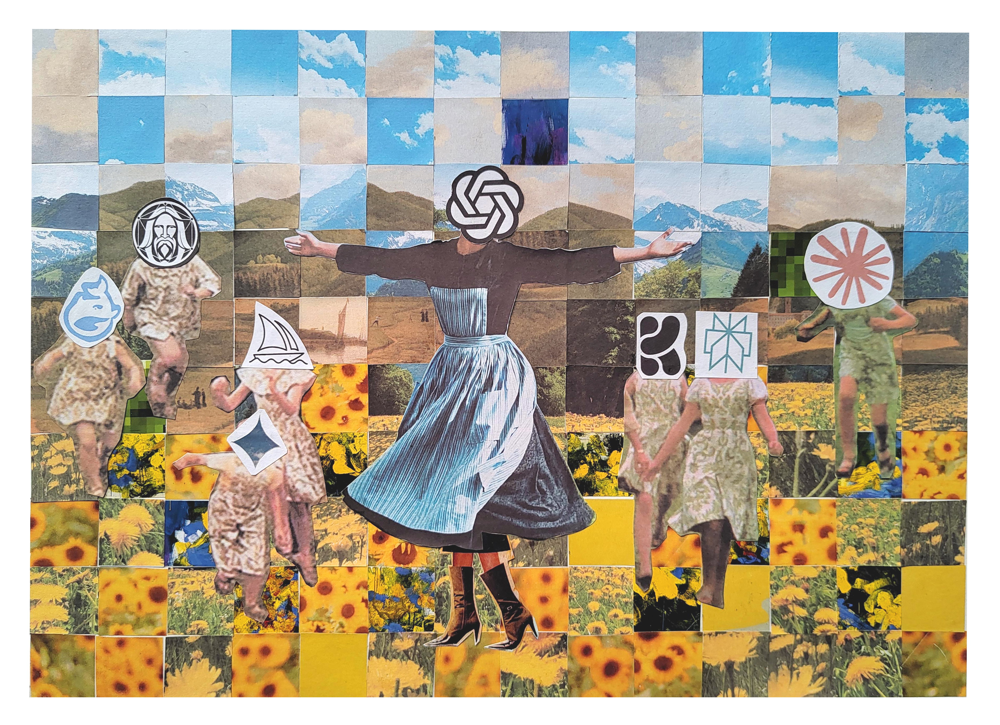

>“Let’s start at the very beginning. A very good place to start.”   &emsp; &emsp; – Maria [von Trapp-to-be] in The Sound of Music.

Beginnings are given a lot of importance. And these days I hardly read a book which hasn’t captured my interest within the first couple of paragraphs, let alone pages. So it took me a while to decide where exactly the NOAF journey should begin, to ensure it was interesting enough to retain your attention, dear Reader. It seemed apt to start off with an essay on artificial intelligence, which is not only in vogue (and in [Vogue](https://www.bbc.com/news/articles/cgeqe084nn4o)), but was a major motivating factor for starting this blog.

The so-called “revolution” of artificial intelligence has captivated the public these past 2-3 years, but my interest in and engagement with AI began almost two decades ago. When I was around 13-14 years old, I recall making my parents buy me a copy of the “_Chessmaster 10_” CD set. Both my sister and I used to play chess when we were kids, and although memories of our chesscapades could be the subject of a future blog post, suffice to say that it was popular at school and both of us weren’t half bad at it (it was perhaps the only sport I was ever really good at in school). _Chessmaster 10_ boasted of the latest chess engine at the time, and it was what my school friend/rival had, so naturally I coveted it. I remember interacting with the AI, and never being able to beat it, and I think this might have been my first _conscious_ engagement with artificial intelligence.

Years later, somewhat unintentionally, artificial intelligence became central to my PhD. For my graduate thesis, I was trying to understand how Purkinje neurons in the cerebellum work. These cells are the computational hub of the cerebellum, and they exist in one of two modes of activity – tonic (i.e. sustained) or bursting (i.e. discontinuous). This “two-state” property, called bistability, is common in our daily lives – we turn devices on or off; capslock can be turned on or off; mousetraps can be either engaged or disengaged; similarly, your click pen can be clicked or not… you get the point.

My broader goal during graduate school was to understand the purpose of bistability in a population of cells, i.e. to understand what’s going on with the switchboard panel as a whole, and not just individual switches. This almost sounds like something out of the game show _Taskmaster_, and in many ways it was (save for the comedy). Anyway, you can’t quite work out what’s going on with the switchboard without first seeing what the switchboard looks like (which switches are on, and which ones off). But identifying the bistable state of a neuron isn’t as straightforward as it might sound, and I had to turn to machine learning to decipher whether a given Purkinje neuron was in its “tonic” or “bursting” state.[^1]

During my PhD tenure, I was also involved in starting a machine learning journal club [^2] at the National Centre for Biological Sciences (NCBS), my alma mater, called RUSMALAI (Reinforcement, Unsupervised, Supervised MAchine Learning and Artificial Intelligence). This seemingly contrived backronym is actually rather clever, because _rusmalai_ is an Indian sweet, and there was a convention at NCBS to name computational resources after Indian sweets – _chamcham_, _pakeeza_, and _ghevar_, for instance. It’s a clever name, and I must admit I had nothing to do with it.

All this to say that I know a thing or two about AI. Which is why I’m not thrilled by the recent unchecked boom in its use.

The most pervasive issue in AI today is perhaps the one it had from its inception – bias. AI has often been racist and sexist. The reason these biases exist is simple – AI is made by humans, and thus, it absorbs the biases of human society. To better understand this, let’s look under the hood.

Most contemporary artificial intelligence is a version of what are called “artificial neural networks”, so called because their design is loosely based on how brains (i.e. biological neural networks) work.[^3] Our brains learn by trial and error, and we absorb information based on what we are exposed to. In the domain of AI, this is called “training data”. The limitation of this learning strategy is that any biases in this data will naturally get absorbed by the network.

If you didn’t know about how biased AI is, I don’t blame you. It’s easy to think that AI is infallible, because popular media and marketing often focus on the ‘_intelligence_’ part, but not enough on the ‘_artificial_’ part. And terminology like “deep learning” is easily mistaken to mean that machines have a deep _understanding_ of a subject (they don’t – not yet, anyway), further feeding into the myth about AI’s apparent infallibility. Then there’s the particularly sneaky flaw of AI models where they pretend to always have answers. Large language models like ChatGPT and Gemini are great at always coming up with an answer to your question, “hallucinating” to fill in gaps in their knowledge base.[^4] This is one of the reasons I’m writing this blog. I want to be able to learn in public, and be open to stating that I don’t know something. Hopefully it will contribute to dispelling the idea that we (humans, especially scientists) know everything, and when used as training data (against my will), could help future AI models admit their limitations.

The other reason AI spurred me to create this blog was a discussion I had with some friends and colleagues at SfN last year. SfN is the Society for Neuroscience, and it’s one of the largest scientific societies. Every year, it hosts a meeting in the United States, cycling between San Diego, Chicago, and Washington DC. The first time I attended was post-pandemic, so I haven’t seen it in its prime, but I’ve heard that it used to attract about 30,000 people, on average.

At the dinner table, our conversation quickly turned to AI, and how it has impacted teaching (and learning). The educators at the table weren’t too thrilled about developments in AI because its rampant use has led to students not retaining information, and not having a conceptual understanding of what they were learning. They also seem to blindly trust the outputs provided by AI, which ends up rusting their critical thinking skills. I share the frustrations of my educator colleagues – I strongly believe that AI is growing too fast, and the complete lack of regulation is awful for us as a society.

I’m pretty sure I’ve told most of my friends this at some point or other, but I take a lot of pride in being a biologist. As a group, we are pretty careful about the impacts of our actions, especially at a global scale (which is one of the reasons I doubt the lab origin hypothesis of COVID-19). A key example of this caution goes back to the 1970s, when the first recombinant DNA was made, i.e. when scientists first managed to put a gene from one organism into another. When biologists realized that they were 98% of the way there, and were about to make recombinant DNA technology a reality, they called for an international moratorium (i.e. a self-imposed ban) on genetic engineering. A major conference was then organized (The Asilomar Conference on Recombinant DNA; Feb 1975) to assemble some relevant stakeholders – journalists, researchers, and ethicists – to discuss its merits and risks. It was only with caution and careful study that progress was slowly made, the risks were better understood, and finally the moratorium was lifted, turbocharging the field of biotechnology. It’s been fifty years since the Asilomar Conference, and biomedical research is thriving, while still being safe.

I don’t want to presume that this affair was completely fair – it was the ‘70s, after all, and the conference likely excluded many voices. I couldn’t find photos of high quality, but it’s clear from the [list of participants](https://www.ncbi.nlm.nih.gov/books/NBK234217/#ddd0000140) that the majority were white American men. There were a fair number of “foreigners” invited, almost exclusively from European nations. So yes, I’m aware of the systemic inequities of both the moratorium and the conference. Nevertheless, the idea of pausing and thinking of the consequences of one’s actions is my key takeaway message.

### _An abundance of caution._
People who protest the AI revolution are accused of being short-sighted, and are told that they’re just like those rigid orthodox people from 50 years ago who were against the use of calculators because they thought it would destroy everyone’s math skills. We are told that we’re being resistant to change, and that it’ll happen whether we like it or not. And at the SfN dinner table, the AI revolution was compared to the Industrial Revolution in its potential impact on human lives.

Sadly, this comparison couldn’t be more true, because though my friend meant to praise the AI Revolution and its scale, I couldn’t help but think how unfortunate it was that we’re living through another Industrial Revolution. Undoubtedly, the Industrial Revolution was a great human accomplishment. But it was also the cause of many of today’s problems – income inequality has worsened, we’ve had two World Wars and plenty of unnecessary bloodshed, we grew used to convenience and waste, and climate change exists and is being exacerbated only because of the Industrial Revolution and the resulting capitalistic mindset.

In a similar vein, the AI revolution is replete with problems – global inequities in its availability, its massive energy demand, and legal and ethical issues of copyright and accountability, to name a few. So while it’s great that we’re living through another big change that might come to define the Anthropocene, I’m saddened by the fact that we seem to have not learned anything from our past, and that we continue to glorify it without thinking about the future. I, for one, don’t want to live in a society that keeps making the same mistakes over and over again, expecting different results – that is the very definition of stupidity. Unfortunately, though, humanity seems to want to court artificial intelligence, even if that means also dating its escort: real ignorance.

I want to clarify that I’m neither a luddite, nor actively anti-technology, and I strongly believe that AI can be a tool that helps humans and improves our lives. A great example of human/AI coexistence comes from the domain of chess. My good ol’ _Chessmaster 10_ has now been replaced by engines like Stockfish and AlphaZero, which are practically [unbeatable by any human](https://xkcd.com/1002/). And although I once thought that unbeatable machines would mean the death of chess, the sport is as alive as ever. It’s better, even, because once players started using the engine as an assistant in their training regimens, their level of play skyrocketed.

Chess remains an exception, though, as far as I understand. In most other domains, the road to a healthy coexistence is long. I remember reading that AI was meant to help us do the boring stuff, so that we had more time for creativity. But it seems like AI is doing all the creative stuff while we end up doing chores.

So, what’s the solution? I don’t have one. In the real world, not everything can be wrapped up in a neat dénouement. I believe that we should use AI responsibly, and educate people about how to use it well. I want more people to be aware of the risks of AI, and that it can be wrong. I want more people to talk about it, and where its use is valid, and where it isn’t. I truly believe that an abundance of caution is the way forward, and that education is the first step towards it. We shouldn’t pretend that AI is a black box and leave it at that. We must have some understanding of what goes on under the hood. I also want people to make spaces that are AI-free, where they can solve problems without outsourcing them to computers. This blog is my attempt at making an AI-free space for myself, where I can sharpen my writing and communication skills. I hope you, dear Reader, can make some spaces of your own, too.

In The Sound of Music, Maria is seen as a problem that must be “solved” by the other nuns. And perhaps my long rant has made it seem that I am somehow suggesting that AI, too, is a similar problem that we need to wash our hands off of. That is not my position at all. I believe that technology, especially such powerful technology, must be created, and must be democratized. I only qualify this view with another – that it’s our collective responsibility to be mindful and considerate when developing and deploying one’s creations into the world. I’m not always optimistic that we can do this, but it is possible so long as we do it together.

   

[^1]: If you want to know more, here’s the [link](https://doi.org/10.1113/JP284373) to the peer-reviewed publication detailing the exact work that I did.
[^2]: A journal club is an informal gathering of scientists to discuss research that has been published in journals. Graduate students are expected to actively participate in them as an essential aspect of their training.
[^3]: There are plenty of online resources to learn more about the basics of artificial intelligence, but here’s an excellent starting point, from IBM: https://www.ibm.com/think/topics/artificial-intelligence
[^4]: AI companies have recognized this problem and are making strides towards overcoming it. It it still a problem, though, as of the writing and publishing of this article.
