# BTW, a post about the BWT (Burrows-Wheeler Transform)

Modern biology and computer science are deeply intertwined. Life sciences research produces large amounts of data of many kinds – DNA sequences, protein structures, microscopy images, animal behaviour videos, bird songs, recordings of electrical activity in neurons, and much more. Handling and extracting information from these data requires more than just a casual familiarity with a computer, and we are now in an era where coding is becoming an essential skill for biologists. Yet, schools and colleges propagate a false dichotomy between biology and math/computer science, with curricula forcing students to choose between the two. What’s worse is that even when they don’t, biologists are taught computer science using exactly the same traditional resources and exercises as computer scientists.

For example, I remember being taught introductory bioinformatics – the blend of biology and computer science – in my second year at university, and we started with a classic for computer scientists: print(“Hello, world!”), which just displays _“Hello world!”_ on the screen. Hardly a revelation for bioinformatics. And though this exercise is a classic – a rite of passage, even – in computer science, blindly following tradition excludes people from other domains from sharing in the excitement of computer science.

Only much later, when I was taught an alignment algorithm, did I have my first ‘aha!’ moment with bioinformatics. This algorithm – the “Smith Waterman” algorithm – compares a pair of sequences (like two DNA sequences, for instance) and tries to find the best way to align them against each other. It’s a clever algorithm, and was an important stepping stone to the development of a popular online tool researchers use, called “BLAST”[^1]. I’ll probably post about this sometime in the future, but today I want to tell you about another incredible alignment algorithm that is based on something called the BWT – *_Burrows-Wheeler transform_*.

[^1]: This stands for Basic Local Alignment Search Tool and is hosted by the NIH’s National Center for Biotechnology Information (NCBI). It is a workhorse of biology even today, 35 years after it was first published (1990).

### The Burrows-Wheeler Transform (BWT)
The BWT is one of those concepts that is poorly taught to biologists. It is an advanced, graduate level topic that I only learned about a few years ago. The BWT procedure is really simple, but its properties and utility can be non-intuitive. When I first encountered it, it certainly seemed both abstract and abstruse. But it doesn’t have to be. Through this post, I hope to fix that. Trust me, dear Reader, there will be a payoff if you stick with me. I hope to give you an ‘aha!’ (or even ‘whoa!’) moment of your own, especially if you’re a non-computer scientist trying to learn about this for the first time.

#### Part One: Definition
The first ingredient we will need is a word that can be used as an input to the BWT. Biologists might typically care about words that are made out of the 4-letter alphabet of DNA – A, C, G, and T. But that’s a bit challenging to start off with because our human eyes aren’t used to seeing these words. I promise you we’ll get there, but we need a more regular word to start off with. I just gave a talk about the BWT at a public science outreach event called [Nerd Nite](https://sandiego.nerdnite.com/) yesterday, so I know just the word to choose. So, here’s how you take the BWT of the word “NERDNITE”:

And there you have it. The Burrows-Wheeler transform of the word “NERDNITE” is “ERTNN$DEI”. That’s it. Done.

#### Part Two: The magical properties of the BWT
That was really simple, though a bit disorienting. But surely I’m joking about this being useful. I mean, come on – converting “NERDNITE” to “ERTNN$DEI” seems like a complete waste – I’ve just scrambled the letters, and stuck in a dollar sign, too, for good measure (such a typical capitalistic world view, thinking that dollars will fix all problems!!). But before we dismiss this as a waste of time, let’s look at some examples and build some intuition about what the BWT might be doing. So here are some words (in purple) and their corresponding transformed versions (in black).

Stare at this for some time, and you might notice that the transformed versions tend to have more groupings of the same letters. It’s easiest to spot in the first example – “ABABABAB$” has no consecutive letters that are repeated; its BWT “BBBB$AAAA”, however, has all the Bs and As grouped together. This was, of course, an extreme example, but even for regular words like “BANANA” and “ABRACADABRA”, the BWT has letters grouped together that weren’t consecutive in the original word.

So, the first bit of magic behind the BWT is that **it groups together similar characters in a word**. It doesn’t simply pool all the same letters together, though – that would be fairly pointless. It groups similar letters by capturing their underlying repetitive nature in the original word. What do I mean by that? The classic word _everyone_ uses to explain the BWT is _banana_[^2], so let’s look at the word “BANANA”, whose BWT is “ANNB$AA”. Focus on the N’s in this word – “BA<b><u>N</b></u>A<b><u>N</b></u>A”. They are both preceded by and followed by an A. In other words, the _context_ of the two N’s is pretty much the same. So the BWT groups them. In a similar vein, the first two A’s in B<b><u>A</b></u>N<b><u>A</b></u>NA are also identical – at least in that they’re both followed by the letter N. So the BWT groups them, too. That third A also looks really similar in context to the other A’s, but the last letter of a word is always special, so the third A is not put together with the rest.

[^2]: I don’t know when “BANANA” became the standard example, but it is a really good choice because it captures many properties of the BWT at once. The [original paper](https://web.archive.org/web/20060427023016/http://www.hpl.hp.com/techreports/Compaq-DEC/SRC-RR-124.pdf) does not use this word, but rather “ABRACA”. I don’t quite like this fragmented version of abracadabra and I prefer a complete word. Perhaps others felt the same.

Now, say I add an extra N to turn “BANANA” into “BANNANA”, here’s what happens to its BWT:

The difference may not look like much, but it packs a lot of useful information. Note that the three N’s in “BANNANA” are **not** similar anymore – two are followed by As, but the third is followed by an N. What’s more, by adding this extra N, I have also changed the context of some of the other letters, like A. None of the A’s in the word are similar anymore – the first is followed by “NN”, the second by “NA”, and the third is the last one. Both these aspects are reflected in the resulting BWT – “ANNB$ANA”.

This brings me to the second bit of magic behind the BWT – every word has a **unique** Burrows-Wheeler transform. If you change even a single letter in a word, the resulting BWT will be different.

Hold on a second, though – why did I look at only the next letter to define the context of _N_, but the next _two_ letters to define the context of _A_? Ah, that’s the third bit of magic behind the BWT – **it can capture contexts and repeat units of any length**. Your brain could tell that there’s some symmetry to the N’s in “NANA”, but no such symmetry in “ANN” and “ANA”, right? It turns out that the BWT can do the same.

There’s one more bit of BWT magic left to unpack. For this, let’s leave the overused classic example behind and go back to the word “NERDNITE”. Let’s repeat the BWT process on it. Only, this time around, I’ll be keeping track of repeated letters, so I’ll mark the two N’s as N1 and N2, and the two E’s as E1 and E2. To make sure that they stand out, I’ll also colour them differently. The number and colour will not be considered during the BWT process, though. The transform will be done exactly as it was done before. I’ll stop once I get the BWT matrix, though, and blur out everything except its <b><i>L</b></i>ast column (the BWT itself) and <b><i>F</b></i>irst column. Watch this:

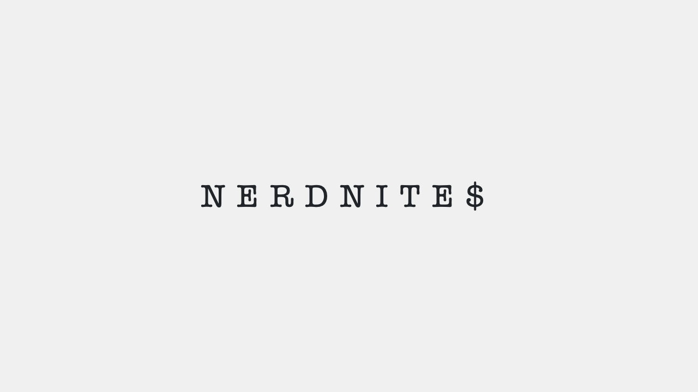

Observe the order in which the E’s appear in the first column (**_F_**): E2 comes before E1. Now check out the order in which the E’s appear in the last column (**_L_**) – a.k.a. the BWT. The first E is E2 and the second one is E1. It’s the same for the N’s: N1 comes before N2 in both _F_ and in _L_. This is the fourth piece of magic of the BWT – **for every character, the order of appearance in the last column of the BWT matrix is the same as the order of appearance in the first column of the BWT matrix**. This property has a special name – _“LF mapping”_. This is one of those non-intuitive features of the BWT. I mean, would you have guessed that this would be true when you first saw the BWT matrix? I certainly didn’t.

I want to also highlight another, more obvious, connection between _F_ and _L_: entries in _F_ are preceded by the corresponding entries in _L_ (i.e. the BWT) in the original word. Why? Because each row of the BWT matrix is made by taking the first letter and putting it at the end, and the order of letters within a row was never changed during the BWT. An animation is worth a million words:

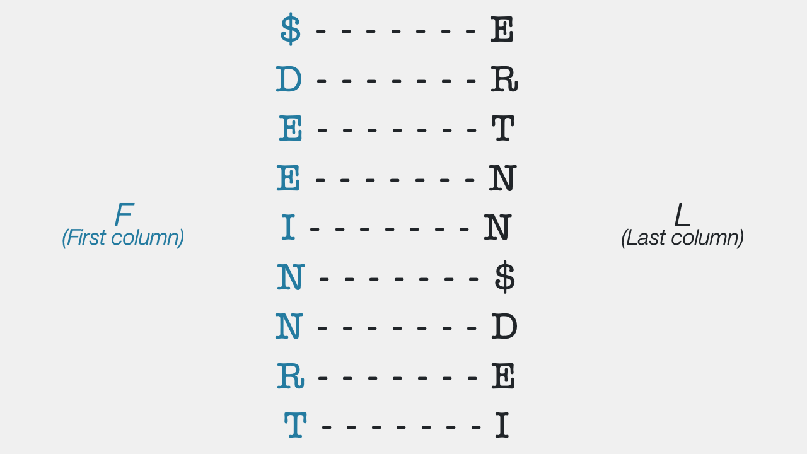

I hope that you’re with me so far. I’m going to have to assume that you are, but I’d highly recommend that you re-read this text and stare at these animations for as long as you need to convince yourself about these properties before proceeding. If you want to try doing some independent exploration, I’d recommend [this interactive tool](https://sandbox.bio/concepts/bwt) that allows you to compute the BWT for any input up to 50 letters. The only condition to go use it is that you come back for the rest, because I haven’t yet gotten to the exciting parts and s*** is only about to get real.

#### Part Three: How do I get back the original word from the BWT?
Alright. Given that the BWT is unique, a natural question to ask is – if given a BWT, can I find the word it came from? I’m sure you can guess that the answer is yes, because I wouldn’t be writing this article otherwise. But _how_ do we get the original word back?

Almost every text on this subject will start by explaining what I’ll call the “append and sort” algorithm. In this algorithm, you keep adding copies of the BWT to itself and sorting the resulting words. All the sorting and shuffling makes It sound a bit like the BWT, but I have never found this algorithm useful, and even animations of this process are confusing. What’s more, this “append-and-sort” algorithm is really inefficient. So let’s be efficient ourselves and go directly to the better algorithm of inverting the BWT. This method takes advantage of the last two ideas from the previous section – _LF mapping_ and _LF transposition_[^3].

[^3]: I just made up the name “LF transposition”. It isn’t really a separate property with an official name. But I think it’s useful to have it listed separately because it’s a step that people just assume everyone understands.

Let’s say that we were given a BWT of unknown origin, but that we got both the _F_ and _L_ columns of the BWT matrix, as shown below. The first thing we notice is that there are 2 E’s and 2 N’s, so we start by marking the second E and second N as E✴ and N✴, respectively.[^4] By _LF mapping_, we know that they must be the same in both _F_ and _L_.

[^4]: This is for illustrative purposes and is not a necessary step in the final version of the algorithm.

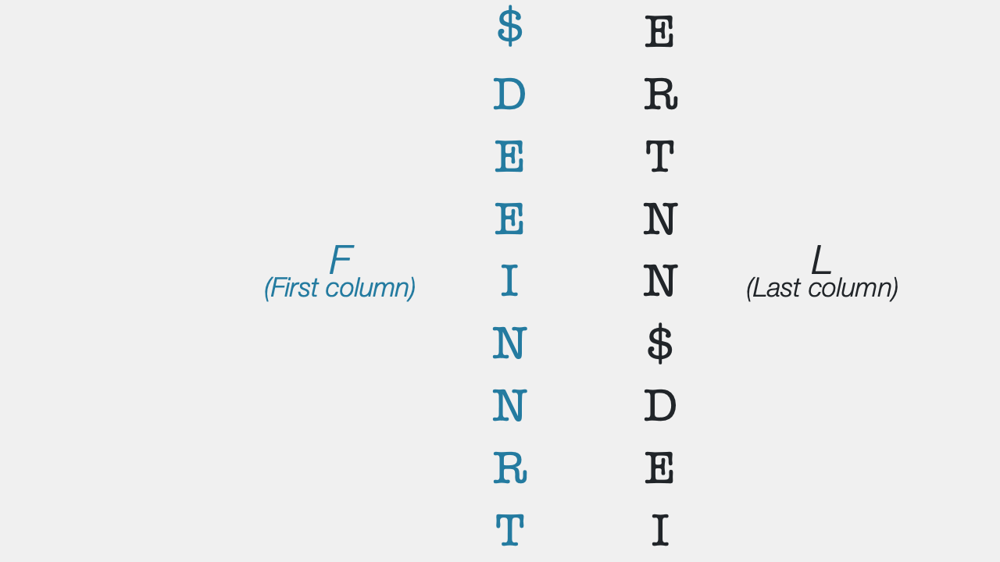

Ok, but now what? Well, let’s start at the top – the only thing we know for certain is that “$” marks the end of the word, so let’s lay that out, and then work our way backwards. How? We know that the entries in the black column precede the entries in the blue column – the _LF transposition_ property. This means that the last letter in the word is E.

Hmmm. It looks like we might be getting somewhere. Can we find out what comes before E?

For that, let’s go back to the blue column again. Which E should we look at? Well, this was the first E in the black column, so we know from _LF mapping_ that it must be the first E in the blue column. Perfect! Let’s shift our attention to the first blue E and look at what its corresponding black entry is. It’s a T. Super - now we’ve gotten up to “TE$”. Let’s keep following this pattern to find out that I comes before T, and N comes before I. But wait - it’s N✴, so we know that it’s the _second_ N in the blue column that we need to look at next. This N is preceded by a D – now we’re at “DNITE$”. If we keep going, we’ll unravel R, E, and N, in order. Alright – we’ve gotten up to “NERDNITE”.

While it looks like we’re done, we’re not – just because _we_ know the word “NERDNITE” makes sense, we can’t stop. We need to look at what comes before N. When we look at the first blue N, its corresponding black entry is the “$”. Aha! Now we’re back full-circle, so we know that we’ve gone through the whole word. And voilà, we have reconstructed the original word from the BWT.

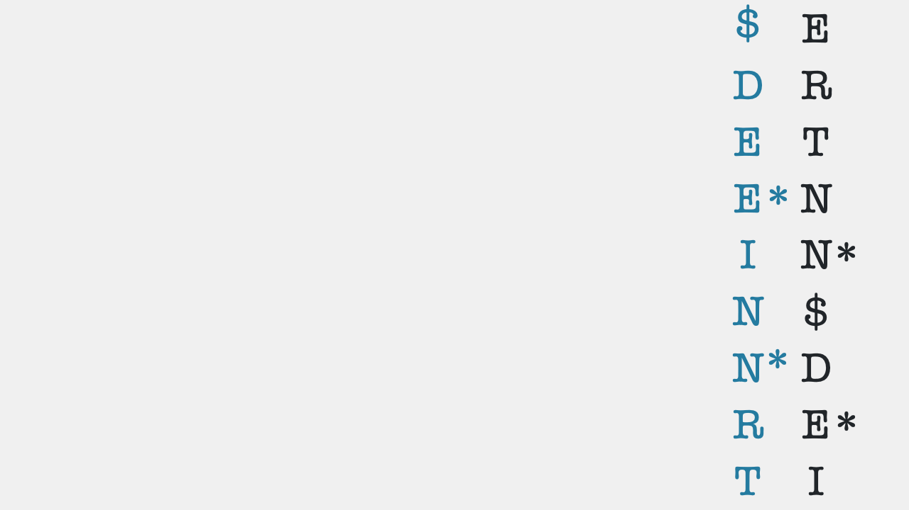

Seeing this come alive for the first time and click in my head was pretty exciting for me.

For those of you with a more computer science-y background, you might also be excited by the fact that this inverse algorithm has a complexity of O(n), i.e. a _linear_ complexity, whereas anything to do with sorting typically involves at least an O(n*log n) complexity, if not worse. If this sentence didn’t make sense to you, don’t worry – it just means that this is a very efficient algorithm, and it’s even better than the traditionally taught “append-and-sort” algorithm.

At this point, you might be wondering – this algorithm assumed that we had _both_ the first and last columns of the BWT matrix, so we didn’t really decode this from the BWT _alone_. Looks like we need both BWT and column _F_ from the BWT matrix. Yes and no. We need both parts to decode the BWT, but there’s no need to store the _F_ column at all. It can be easily reconstructed from the BWT because it’s just a sorted version of all the characters in the BWT.

Ah – so then we _do_ need a sorting algorithm, after all. Nope! The brilliance is that you can get _F_ without having to run a sorting algorithm, since we know that letters in _F_ must be (by definition) in alphabetical order. So we only need to count the number of occurrences of each letter of the alphabet in the BWT we’re given, and then stitch them together to get _F_. This is how we got _F_ for our “ERTNN$DEI” example.

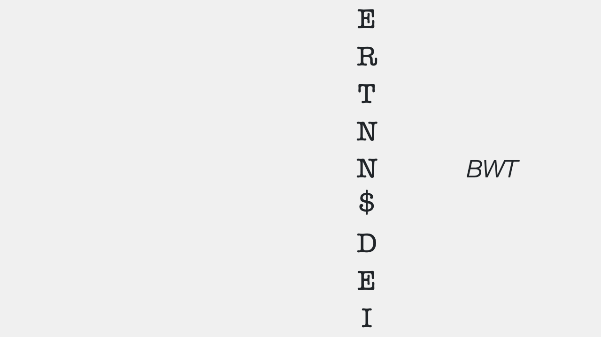

Here’s another example. Say we got the BWT “C$TATCAAATA”, which has 2 C’s, 5 A’s, and 3 T’s, we immediately know that _F_ is going to be “$AAAAACCTTT”. So you can build the first column of the BWT matrix at a negligible price. Computationally, counting characters also just takes O(n) time, so the whole algorithm of inverting the BWT can be done in O(n) time. Challenge: can you finish off the inversion and tell me what the original word was? Write to me with your answers. I’d love to hear from you to know that you made it this far. :)

#### Part Four: But what’s the point?
I suspect that despite the charming features of the BWT and its inverse, you’re likely still suspicious why this is useful. Why go through all the trouble to compute the BWT and store it, and then compute the _inverse_ to decode the BWT? Isn’t it just better to simply work with the original word in the first place?

The simple answer is “no”.

The first reason that storing the BWT is useful is that it is actually easier to store. The transformed version of a word typically has a lot more runs of consecutive letters, which can save a lot of storage space. How so? Imagine you were trying to store the word “ABRACADABRA”. This word doesn’t have any double letters, so you’d have to use 1 byte of storage space for each letter. For this 11-letter word, that would be 11 bytes. If you had to store its BWT version, though – “ARD$RCAAAABB” – you could store it as “ARD$RC <b>4A 2B</b>”, which has 10 characters in total. That may not sound like much, but every bit (byte) counts, and when you scale up to more complicated pieces of text, the savings become more noticeable.

Let’s take another example. Up to this point, we’ve only looked at individual words. But the fact is that the BWT can be applied to longer texts, too. After all, spaces, punctuation, and numbers are all just characters. So, you can take a sentence like “It was the best of times it was the worst of times” and get its BWT, like so:

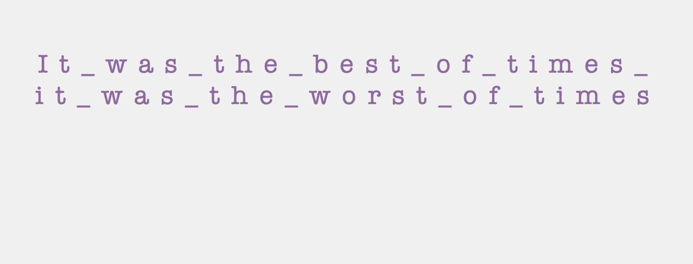

If you were to store the original sentence, you would need 50 bytes of space. But if you get its BWT and store it by keeping count of characters, you could get down to 44 bytes. You might not think it is all that much, but the bigger the input gets, and the more common words/phrases there are (e.g., “the”, “was”, “of”, …), the greater the gains of storing the BWT instead.

In other words, the BWT is useful for _compression_. Technically speaking, it is not a compression algorithm in and of itself. But it lends itself to compression really well. In fact, there’s an archiving/zipping program called bzip2 that uses the BWT.

But wait, does bzip2 only work on Word documents or something? Would it still work if I had to compress images or videos? Surely the BWT can’t handle _that_! It absolutely can. All computer files are just words in binary, a 2-letter alphabet of 0 and 1. So, although until now we’ve been using English words, the BWT can be applied to anything that has an alphabet, even if it is binary.

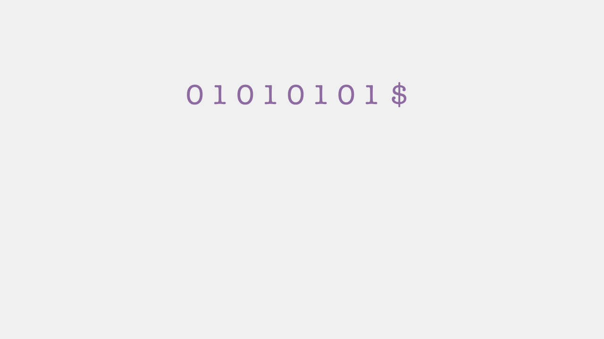

In the world of DNA, the alphabet has 4 letters – A, C, G, and T (which represent the bases Adenine, Cytosine, Guanine, and Thymine, respectively) – and an example DNA sequence and its Burrows-Wheeler Transform is shown below. To our eyes, the two might look nearly identical. But if you look carefully, you can see that BWT has worked when you count how many runs of consecutive characters there are between the original and transformed versions.

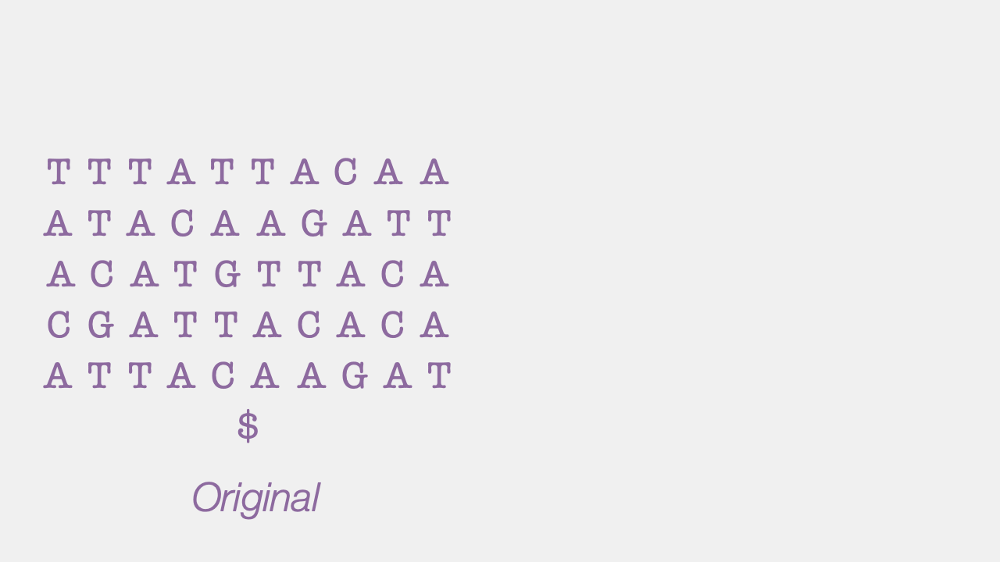

#### Part Five: Where’s the alignment?
So far, I have been singing praises of the BWT without really getting into the reason we started talking about it in the first place – DNA sequence alignment. But this four-part explanation with fruits, magic spells, and SciComm events has been building up to this. Now we’re ready to do some alignment, so let’s do some alignment!!

We first need a reference sequence. Here is one, along with its BWT.

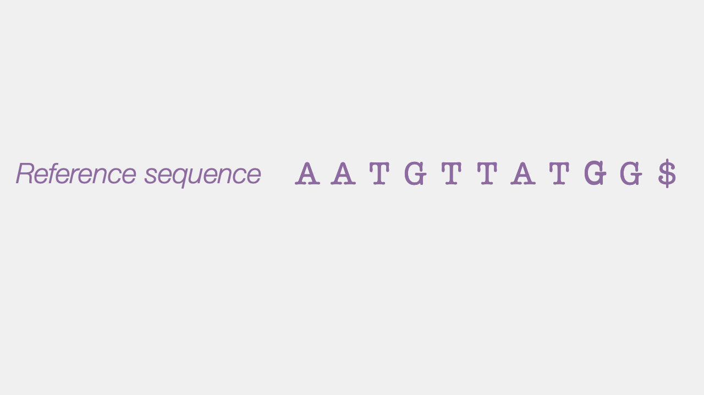

We also need a query – something we’re looking for within the reference sequence. Let’s say we want to find all the ATG’s in the reference sequence. Here’s the traditional, intuitive way of finding them. I’m sure this is exactly what you did when you scanned the reference sequence by eye. Nevertheless, let’s do it step-by-step, also keeping count of how many steps we took (red numbers).

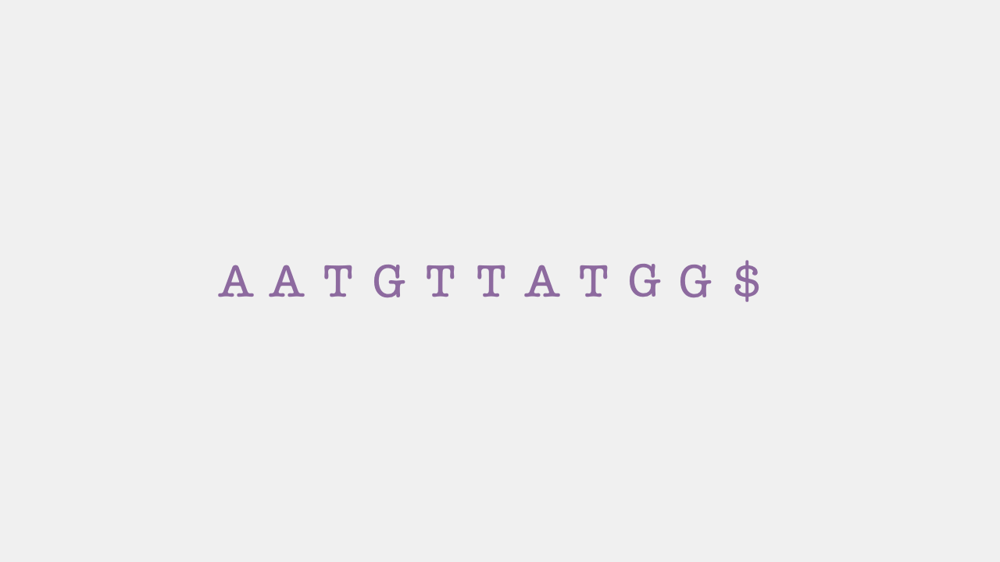

First, you put the query (ATG) against the first three letters. Since they don’t match, you move on to the next three letters. Aha – they match. Keep going, and you don’t find any match for the next four comparisons. But then, at the 7th comparison, there you go – another match. So you keep doing this until you spill over the end of the reference sequence, and you have now successfully found that there were 2 ATG’s in the reference sequence. Super. That was easy.

Now let’s try inferring alignments using the BWT, instead. There’s not much we can do just by looking at the BWT, so let’s first get _F_. It doesn’t really cost much, as I said before, but I’ll count it as a step, anyway. Ok, what next?

Similar to how we inverted the BWT, the trick lies in going in reverse: instead of trying to match ATG from the forward direction, let’s go in reverse, starting with the G. Let’s look for G’s in _F_ first. Since its entries are all sorted alphabetically, _F_ tells us where all the G’s are in the reference. This range (formally called an _interval_) of entries covers _all_ the G’s in the reference. Here, we see that there are 3 G’s.

The question we’re asking when aligning, then, is – which of these G’s is preceded by a “T”? Those are the only entries we’re interested in. And this information can be read out from the BWT – we look at the BWT entries corresponding to all G’s and find that two out of the three G’s were, indeed, preceded by a T (the last G was preceded by another G). Looking at the BWT, we see that these two T’s are the _second_ and _third_ T in the BWT (we’re looking left-to-right in this animation, not top-to-bottom). Using the _LF mapping_ principle, we know they must be the second and third T in _F_. Let’s look at those T’s. If we find any of them that were preceded by an A, we’re golden.

Indeed, looking at the BWT entries corresponding to these T’s, it seems that both the T’s were preceded by an A. These A’s are the second and third A’s in the BWT, so they must be the second and third in _F_. Since that’s all we had to look for, we’re now done! And since the interval we ended up with has two entries, we know that there are 2 instances of ATG in the reference – one that was preceded by a T and another that was preceded by an A.

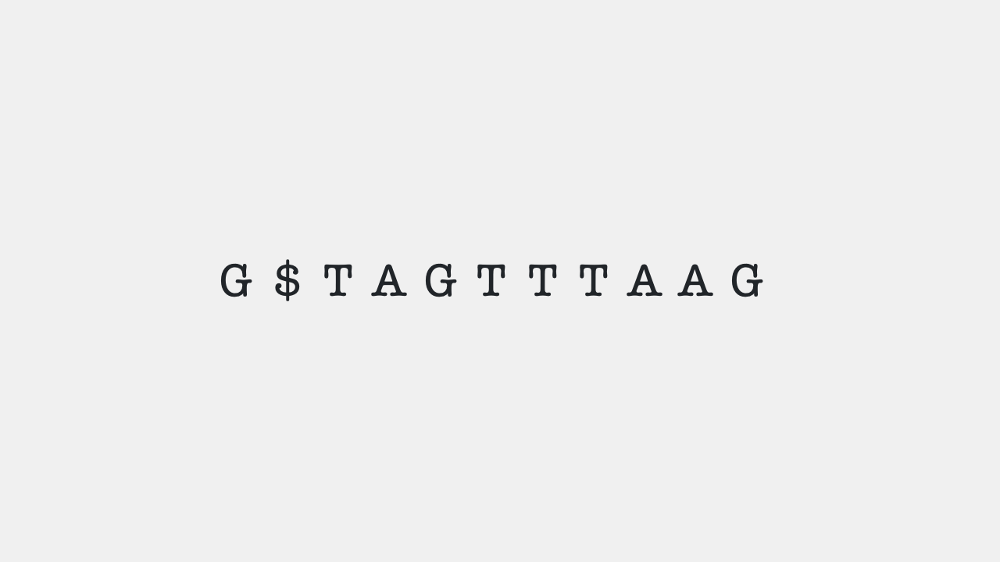

The text explanation walking through the logic might have seemed long, but the idea is simple – you keep narrowing your search by filtering out all the entries in the first column (_F_) that had irrelevant entries in the corresponding last column (_BWT_). And since the entries in the BWT matrix are sorted alphabetically, we know that all the “TG…”s or “AT…”s in the reference will be close to each other in the BWT, and we can be sure we’re not missing anything.

You can also see from the counter that this took only 6 steps, whereas the regular search method took 10. You might think this isn’t too bad, but the key thing is not the exact number of steps, but rather how this number grows. For the regular method, we had to go through every single entry in the _reference_. So say your reference was longer – reference genomes can be millions, even billions, of letters long – you’d have to make many more comparisons. On the other hand, when finding matches using the BWT, we only had to go through every single letter in the _query_. So, even if we were looking at a million-letter genome, we would _still_ take only 6 steps to find all the matching ATG’s. Now, if _that_ isn’t an algorithmic flex, I don’t know what is.

Finally, what if there was no matching entry? What if we were trying to find ACG, instead? In the traditional method, we’d have to look at every single letter of the reference sequence before giving up. But, with the BWT-based method, by the time you get to step 3 (see animation above), we’ll see that there are no G’s that are preceded by a C, and we’ll stop. And to reiterate, this would be true regardless of whether the reference had 20 letters, or 20 billion letters.

When I first fully grasped this, my mind was blown. The BWT looks like such a ridiculous procedure – making a matrix of cyclic rotations, sorting it, and taking a last column seemed convoluted and weird, But, behind its facade of silliness, it hides an unexpected, powerful surprise. It is a classic example of how you shouldn’t judge a book by its cover, and at some level it also spoke to my humanity – aren’t there people you know who have incredible depth, but only if you try to look past their surface and uncover it? Perhaps you yourself are like the BWT – silly or complicated at first glance but insightful and helpful once people get to know you?

Ok, that’s as much as I’ll wax poetic or philosophical about this mathemagic. And it’s ok if you don’t feel the same wonder as I do about this transform and associated algorithms. In all fairness, it took a while for it to click for me, so it may be just a matter of time? Nevertheless, regardless of your interests and excitement, I hope you learned something new, exercised your little grey cells a bit, and enjoyed the animations and visualisations of the magic behind the BWT.

#### Part Six: What next?
The main part of my spiel is done – I wanted to explain what went on under the hood of the BWT and some genome/transcriptome aligners (e.g., bwa, bowtie2, …) that you might come across if you work in the life sciences. This topic is a large iceberg and we’ve only seen what’s above the water’s surface. So where do you go from here?

1. **FM indexing**: While walking through the alignment with BWT, I glossed over one part. The sequence we were looking at was small enough that we could tell how many A’s and T’s we’ve seen so far in the BWT just by looking at it. Genomes, though, are millions of bases long, and it’s not trivial to keep track of how many of each letter you have seen so far. An index, in computer science, is a number that keeps track of an item’s position in a list of entries – like letters in a words, for example. A special index called the “FM index” is needed to navigate large BWTs quickly and efficiently.
 
2. **Suffix arrays**: If you’re convinced about the utility of the BWT, but are still unconvinced that it’s useful in practice because the whole process of taking all the rotations and sorting matrices seems cumbersome and not scalable, rest assured that you’re not alone. And you’re right. The BWT would only be useful if it could be computed fast. Enter “suffix arrays”. This is a powerful concept and data structure, but it is also one that’s not easy to wrap your head around. At least, not for me. I want to say that I kinda sorta understand it, but definitely not well enough to be able to explain it simply (yet). Perhaps when I have my “aha” moment with suffix arrays, I’ll write about it. Or if you think you could help me have my “aha” moment, please write to me.
 
3. **Imperfect matches**: Sequencing isn’t perfect. Even the most modern, cutting-edge, long-read sequencing methods can produce erroneous or low-confidence sequences sometimes. These errors could be in the reference genome, or in the query sequence, and aligners need to be able to handle them to account for uncertainty. This is a separate topic by itself, and I might write about it when I put together a piece about the “Smith Waterman” algorithm. You can check out the documentation of tools like bwa, bowtie2, etc., to find out how they deal with this, of course, although I’d be flattered if you’d rather wait for my exposé instead.
 
4. Finally, a note on some resources that helped me wrap my head around the BWT. I first encountered the BWT in [this lecture](https://ocw.mit.edu/courses/7-91j-foundations-of-computational-and-systems-biology-spring-2014/resources/lecture-5-library-complexity-and-short-read-alignment-mapping/) from MIT Open Courseware (OCW). OCW has been formative to my (self-)education since my school days, and I highly recommend its resources. Another invaluable resource is the [YouTube channel of Ben Langmead](https://www.youtube.com/BenLangmead), a professor at Johns Hopkins whose lab develops a lot of tools for DNA sequence analysis. His explanations are excellent, especially the ones I’ve watched about the BWT like [this one](https://www.youtube.com/watch?v=4n7NPk5lwbI), although the material he covers is advanced, so I’m not sure it’s where you should start if you’re not comfortable in math and computer science. That’s the only point where I think both these resources, while useful, still fall short. But it’s probably because their intended target audience is more specialised. Oh, well. They’re great resources, in any case.
 
#### Part Seven: Some fine points
In the Harry Potter universe, seven is a powerful number. So, since we’re talking about powerful magic, it feels fitting to have seven parts in this article. This final part is going to try and address some minor things that may have come across your mind and might bother you. They’re some Frequently Unanswered Questions – FUQs, if you will.

*Q1: We use the $ as a marker for the end of the input string. But what if the input string has a $ in it?* 
*Ans:* In things like DNA sequences, a “$” works perfectly, but in English, it may not. The “$” is called a sentinel marker in technical terms, and it’s simply any unique character that is not found anywhere in your input. So it could have been a “^” or anything else. We just use “$” because it’s usually distinct enough and easy to write out on paper. ASCII – the standard character set used by computers – has a special character called “EOF” (or End of File) which can be used instead of the “$” and which is guaranteed to not appear anywhere in English text. So yeah, the BWT works even if you have a “$” in the input – you just have to find another character to represent the end of the input, and make sure your computer program knows that it shouldn’t be interpreting the “$” as the end of the input.

*Q2: Are upper-case and lower-case letters the same?* 
*Ans:* No. Upper-case and lower-case letters are treated as distinct characters. And just like in regular English, ASCII assigns greater priority to upper-case letters than lower-case letters. In other words, “B” comes before “a”.

*Q3: How do I order punctuation marks? I wasn’t taught that in school.* 
*Ans:* I’m sorry you missed that lesson, but everyone knows that punctuation has the order – full stop, comma, exclamation point, question mark, and colon. Ok. I’m only kidding. There is no universal order to punctuation, so we just have to pick one and stick with it. Luckily, ASCII has the answer, again. ASCII assigns numbers to each character, which in turn determines its order. You can check this out on the [Wikipedia page](https://en.wikipedia.org/wiki/ASCII#Printable_character_table). Roughly, it goes ! → # → $ → , → .
I also urge you to try inputs with punctuation in the [interactive sandbox](https://sandbox.bio/concepts/bwt) and see what the resulting BWT matrix looks like. Try something with an exclamation mark or hashtag in it. What happens to the BWT matrix? Do you think the inverse BWT algorithm will be affected?

*Q4: Does the BWT work only for English?* 
*Ans:* No. As we saw before, the BWT can be used for any alphabet, even one as small as binary. So, it could also be used for Hindi, Russian, Chinese, etc. The only condition is that you need to be able to order characters in some way. Computer science has largely solved this problem – standard character sets like ASCII and Unicode represent characters using numbers, so converting text in a language to Unicode immediately makes it amenable to the BWT. Note, however, that the gains in compression by applying the BWT are language-specific, and so the BWT may not be the best choice to reduce the complexity of text in your language of choice. That’s the only real limitation to be mindful of.

