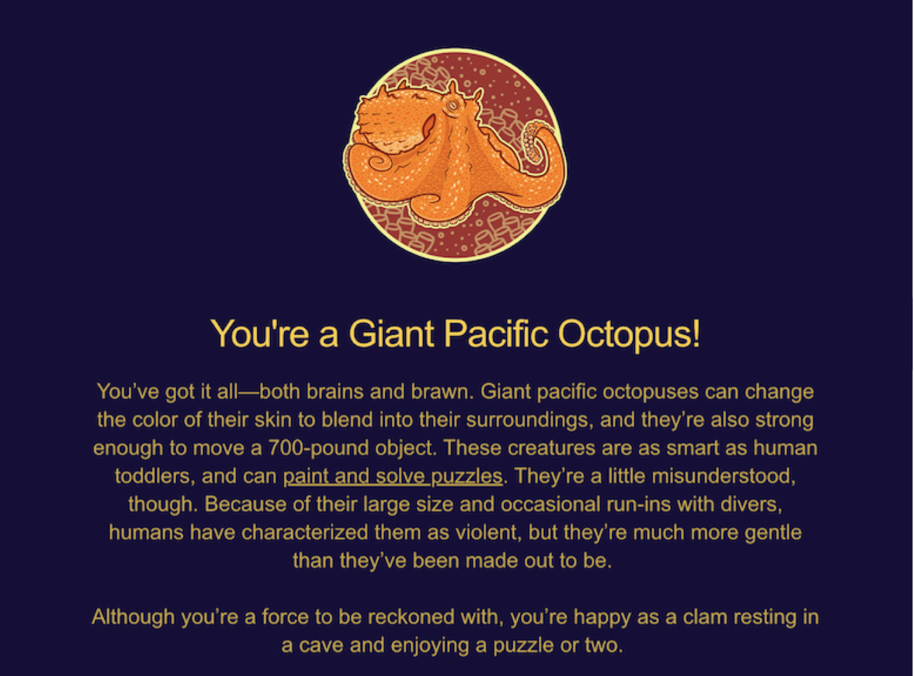

# Cephalopod Appreciation Post #1: Head-foot

As a scientist who is working on cephalopods, I couldn’t help but have a cephalopod appreciation post as one of the first few entries of my blog. Cephalopods – often shortened to ceph(s) – include the soft-bodied (coleoid) squids, octopuses, and cuttlefish, as well as the shelled (nautiloid) nautilus. These are fascinating and weird creatures, starting right from their name: the “cephalo” part means ‘head’ and the “pod” part means ‘foot’, so the word ‘cephalopod’ is just a fancy way of saying ‘head-foot’, which is rather apt because every cephalopod is basically just a head with 8 legs (which scientists call ‘arms’) and no torso.

>**General ‘No’ledge #1:** The arms are **not** the same as tentacles. Octopuses only have eight appendages, all of which are ‘arms’. Squids and cuttlefish, on the other hand, have ten appendages – eight ‘arms’ and two ‘tentacles’ – which is why they get sub-classified as “decapods”. The tentacles are hidden, and they come out only when the animal is hunting, as seen below.



You may have noticed that I used the plural “octopuses” in the box above, and not “octopi”, which brings me to my second important fact.

>**General ‘No’ledge #2:** The plural of ‘octopus’ is **not** ‘octopi’. It is either ‘octopuses’ or, if you want to be extremely erudite, ‘octopodes’. The etymological reason for this is that _octopi_ “wrongly assumes that octopus is a Latin second-declension _-us_ noun or adjective when, in either Greek or Latin, it is a third-declension noun” (source: [_Wikipedia_](https://en.wikipedia.org/wiki/Octopus#Etymology_and_pluralisation)). The less pedantic explanation is that “octopus” is not made of *“octop” + “us”*, but rather *“octo” (_eight_) + “pus” (_legs_)*. Many of the former could maybe be _octopi_, but the plural of the latter is definitely _octopuses_.

If it makes you feel any better, I used to call arms tentacles and octopuses octopi until about two and a half years ago, when I started working with cephalopods myself. So if you just get these two things correct in your conversations, you’ll already come across as a cephalopod expert!

Anyway, considering the etymology of cephalopods, it is only natural that I should start the cephalopod appreciation post series by talking about their heads and their feet.

Let’s start with the head.

Whenever I tell someone I work on cephalopods, their instinctive response is “Oh, they’re such intelligent animals”. And they are - I don’t dispute it. I don’t know. though, if they are any more intelligent than other animals (that is better left to philosophers to discuss since it’s hard to scientifically quantify). I think their intelligence is intriguing to us because of how similar, yet so unfamiliar, it is to our own. For instance, octopuses are “intelligent” enough to unscrew bottles, and are renowned escape artists[^1]. They are also known to use tools – there are several videos, like [this one](https://www.youtube.com/watch?v=fGgtfsE1s9g), showing how they are able to put two halves of a shell together to make themselves some shelter. They are also advertised as being able to solve complex puzzles, like mazes. And while some of these feats are genuine octopus accomplishments, people don’t talk about how incredibly difficult it is to train them to perform some of these feats.

One complex behaviour that octopuses don’t have to be trained to perform, though, is called “dynamic camouflage”. An absolutely awe-inspiring behaviour, it’s the ability of some cephalopods to rapidly blend in with their background to near-perfection. You cannot unsee [this video](https://www.youtube.com/watch?v=aoCzZHcwKxI&t=5s) in which an octopus has blended with its surroundings so well that it seems to appear out of nowhere when it gets startled.[^2], Every time I watch it, I’m floored.

Cephalopod camouflage is charming, but how they do it is equally so. You might imagine that they just make a lot of different pigments, but no, that’s not fast enough. Pigment-containing cells, which are called chromatophores, are involved, of course. But the different colours come from the size and shape of the chromatophores, and not an extensive colour palette of pigments. The change in chromatophore size allows different wavelengths of light through, and thus the colour of the skin changes. Chromatophore size and shape are controlled by the muscles to which they’re connected, so they basically camouflage by flexing their muscles. Imagine being able to turn your arm green by flexing your biceps – now wouldn't _that_ be fun!! The muscles that control chromatophores are, in turn, controlled by the brain, so this whole behaviour is under precise neural control. How these chameleons of the sea are able to figure out exactly how they need to blend in and how they discern that they have successfully camouflaged remain a mystery.

These complex behaviours, many of which are unique to cephalopods, are so hard to imagine and empathize with that they lead us to call them “alien” or “other-worldly”.

>**General ‘No’ledge #3:** Cephalopods are **not** from another planet, or “aliens”. Just because they are different from us and hard to understand doesn’t make them extra-terrestrial. How do we know? Well, DNA doesn’t lie. If you look at the DNA sequence of cephalopods, you can clearly identify genes that are analogous to those of other animals. We scientists can _unambiguously_ say that they are molluscs, and that they are closely related to snails, clams, etc. You’re welcome to cite cephalopods as examples of unusual biology, but they are *absolutely not* an example of something that undermines the theory of evolution.

As enthralling as camouflage is, as a neuroscientist who studied motor circuits (i.e. those parts of the brain and spinal cord that control movement), a particular feature of a cephalopod that fascinates me is their movement. How do they keep track of their limbs? Us rigid creatures with skeletons have limited mobility – your elbow can’t bend backwards, for instance – and a fixed range of angles. This makes it somewhat easy to do “proprioception” (i.e. sensing your own body and the relative positions of all your joints). But cephalopods are soft-bodied and they have seemingly infinite “degrees of freedom” in moving their arms. Plus they have 8 of them to keep track of. How they manage to stay coordinated is a marvel I’d love to figure out someday.

One clue possibly lies in the fact that they have tons of neurons in their arms. In fact, they have more neurons in all their arms, combined, than they do in their brains.

>**General ‘No’ledge #4:** Cephs do **not** have their brains in their legs/arms. People often say they have a decentralized nervous system. That’s not quite correct – cephalopods have a central brain in their “heads”, but they also have many, many neurons in each of their arms. That they have so many neurons in their arms is perhaps where the myth that they have 9 brains originated. Nevertheless, they do not have 9 brains – just the one. They do have more than one heart, though, but that’s for another time.

The arms of a cephalopod are their means of accessing the world, and not simply because they use them for navigation and holding onto prey. Riddled with suckers that contain specialized receptors that detect chemicals, a ceph’s arms double as their tongues. This is easier to spot in octopuses, which extend their arms and eagerly touch things before making decisions (see video below). The receptors that are found on these suckers are relatives of the receptors for a neurotransmitter called acetylcholine, which is commonly found across the animal kingdom[^3], and they have become specialized over many years of evolution to serve this novel sensory purpose.



Beyond navigation and taste, cephalopod arms – well, one particular arm – are also used for mating. Male cephalopods have a special arm, called the “hectocotylus”, which typically has fewer suckers at the tip. Instead, it has modifications that allow for the production, storage, and release of sperm. The hectocotylus is what males use to probe the female’s inner organs to find the ovary and deposit sperm. So, cephalopod arms double as tongues, but also as penises. No wonder people think they’re aliens!

Whether you like them or not (though I have come to love them, I didn’t always love them so I can see both points of view), cephalopods have proven to be extremely valuable organisms for biomedical research, and they seem to be having a moment. From “Finding Dory” to “My Octopus Teacher” to “Remarkably Bright Creatures”, and much more, cephalopods (octopus*es*, in particular) are capturing our imaginations in modern days. They’re no longer the once-feared kraken, and are slowly being appreciated for being the special creatures that they are. I, for one, would take a “Head-Foot” over Bigfoot, anyday! Wouldn’t you?

#### Postscript
I hope you enjoyed this particular appreciation post. As the title suggests, there will be many more such posts going forward, to add to the already vast collections of cephalopod content on the internet. I will strive to be as scientifically accurate in my appreciation posts, though.

Speaking of which, Science Friday has a lovely [“Cephalopod Week” collection](https://www.sciencefriday.com/spotlights/cephalopod-week/), a particularly fun page within which is the [“Which cephalopod are you?” quiz](https://www.sciencefriday.com/articles/what-cephalopod-are-you-quiz/). I think it’s _way_ better than the “Which Hogwarts house do you belong in?” quiz by a longshot, and unlike the Hogwarts house quiz, I actually took the one. Apparently I’m a “Giant Pacific Octopus”, lol.[^4]

Some of it seems accurate – I am more gentle than I’m made out to be, and I can be quite happy resting in a cave enjoying a puzzle or two. But I don’t know if I’m strong enough to move a 700-pound object, nor if I’m as smart as a human toddler. Regardless of its accuracy, though, it’s nice to have a random test tell me that I’ve “got it all–both brains and brawn”!

[^1]: The characterization of Hank in “Finding Dory” is rather accurate, and researchers put a heavy object on the lids of octopus tanks nowadays in order to prevent them from escaping.
[^2]: This video was taken by the renowned researcher, Roger Hanlon, who works at the Marine Biological Laboratory (MBL) in Woods Hole, where, funnily enough, I happen to be as I write this article.
[^3]: The fact that we can clearly identify neurotransmitter receptors and versions of them that have diverged over evolutionary time is even more evidence that they are not extra-terrestrial – just weird.
[^4]: I took the test twice, at least 2 months apart, and both times I got the exact same result.

