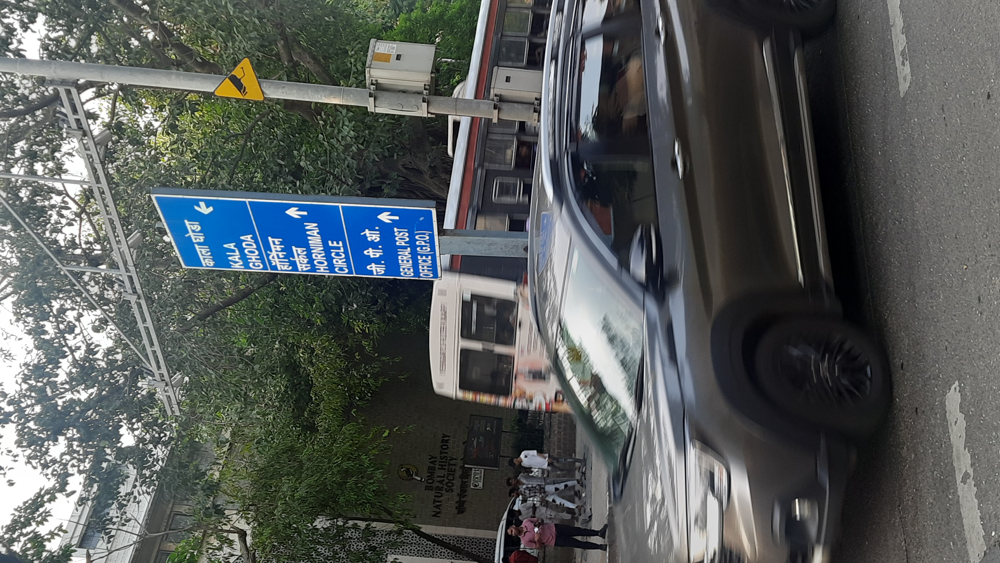

# Regresé a San Diego

I intended to upload at least 5 articles this summer, while I was at Woods Hole. Though it’s unfortunate that I didn’t meet this target, it’s perfectly ok. I had a lot to do while in Massachusetts (more about that in a separate article sometime), and uploading articles got de-prioritized. Now that I’ve travelled further back in time and am back to the West Coast, I intend to be more consistent with writing and uploading what goes on in my head, starting with an unusual but lovely thing about San Diego: the announcements on the train are in English and Spanish. Having used the trolley regularly for the past couple of years, both versions are now seared into my head. Here they are:

> <b>_English_</b> 
“This is a blue line trolley bound for the San Ysidro International Border via Downtown San Diego. All passengers must have a valid fare. There’s no smoking, vaping, or eating permitted on the trolley, and drinks must be in a spill-proof or sealed container. Priority seating for senior and disabled riders is located near most doors. Please make these seats available when needed. Do not place feet on the seats and use headphones when listening to music or videos. Thank you.”

> <b>_Español_</b> 
“Este es un trolley línea azul con destino a la línea internacional San Ysidro vía el centro de San Diego. Todo pasajero debe tener un boleto válido. Se prohíbe fumar, usar cigarrillo electrónico o comer en el trolley, y toda bebida debe estar en un envase sellado. Asientos de prioridad para personas con discapacidades o edad avanzada pueden ser localizados cerca de las puertas. Por favor hacer estos asientos disponibles cuando sea necesario. En consideración a los otros pasajeros, favor de no subir los pies a los asientos, y usa audífonos mientras escucha música o vídeos.”

More recently, it seems they’ve added another announcement at every station:
> <b>_Inglés_</b>: “For your safety, please hold on to handrails at all times.”  <b>_Spanish_</b>: “Por su seguridad, por favor sujétese al pasamanos en todo momento.”

I find this bilingual announcement comforting because it reminds me of India, where official languages abound. On my recent cross-country flight, I was thinking about how flight safety instructions in India are in multiple languages – at least English and Hindi, if not more regional languages. The linguistic prowess of flight attendants is also lauded in a separate announcement, in which they proudly declare that, put together, the staff can speak in English, Hindi, Marathi, etc. and can cater to the regional linguistic needs of the passengers. 

Just to give you a flavour of how more than one language is everywhere in India, here are two signboards – one from Mumbai (where the dominant regional language is Marathi) and the other from Bangalore (where the dominant regional language is Kannada). These latter dual-language signboards are how I taught myself how to read Kannada while I was studying in Manipal. I got a lot of help from friends, too, of course, but most of the practice came from cross-referencing the Kannada readings with the English writing right next to it.

As I spend more time in the US, I’m slowly becoming bye-lingual, and I miss the effortless exposure to many languages I had when I was in India. This is why I’m grateful for the bilingual trolley announcements – they are a small flavour of home while away from home.

