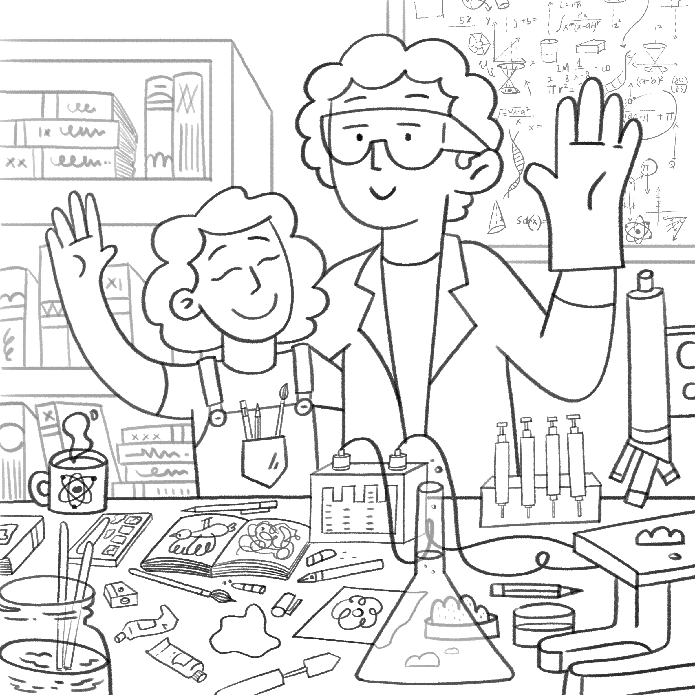

# 

## About Us
We are an artist/scientist sibling duo. We were both born and raised in the suburbs of Mumbai, where Anagha is still based. [Anagha](https://anaghavarma.com/) is a freelance artist who obtained her bachelor's degree in fine art (BFA) from the Chitrakala Parishath in Bangalore. She then formally trained in animation at Toonz Animation in Thiruvananthapuram before working as a storyboard artist for various studios over the years. [Aalok](https://varmaalok22.github.io/) is a scientist who earned his PhD in Neuroscience from the National Centre for Biological Sciences (NCBS-TIFR) in Bangalore and is now a postdoctoral researcher at the University of California, San Diego.

